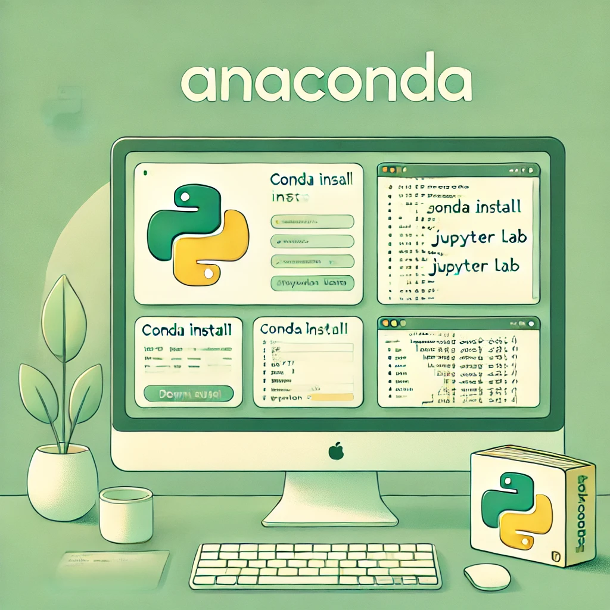

# 0. Anaconda Setup and Environment Preparation



Welcome! Before diving into Python programming, it's important to set up a clean and reliable development environment. In this section, you'll learn how to install Anaconda and prepare your system for working with Python projects effectively.

---

## ✅ What is Anaconda?

Anaconda is an open-source Python distribution that includes:

- Python interpreter
- Package manager (`conda`)
- Preinstalled libraries (NumPy, Pandas, Matplotlib, etc.)
- Environment management tools
- Jupyter Notebook and JupyterLab

It's ideal for beginners, especially in data science, machine learning, or scientific computing.

---

## 🖥 Installation Steps

### 🔹 macOS
1. Go to [Anaconda Download Page](https://www.anaconda.com/products/distribution)
2. Download the macOS installer (choose Intel or Apple Silicon according to your chip)
3. Open the `.pkg` file and follow the instructions
4. After installation, open the **Terminal** and type:

```bash
conda --version
```

If it shows a version number, Anaconda is successfully installed.

### 🔹 Windows
1. Go to [Anaconda Download Page](https://www.anaconda.com/products/distribution)
2. Download the Windows installer (64-bit recommended)
3. Run the installer:
   - Choose "Just Me" during install
   - Keep default install location
   - Check the option "Add Anaconda to my PATH environment variable" (optional)
4. After installation, open **Anaconda Prompt** and type:

```bash
conda --version
```

---

## 🚀 Launching JupyterLab

You can open JupyterLab from the Anaconda Navigator or directly in the terminal:

```bash
jupyter lab
```

This will open JupyterLab in your default browser.

---

## 🧪 Verifying Python

To verify that Python is working, run:

```bash
python --version
```

Or, inside a Jupyter notebook:

```python
print("Python is working!")
```

---

## 📦 Creating a New Conda Environment

Although you can work in the base environment, it's good practice to create separate environments for each project:

```bash
conda create -n myproject python=3.11
conda activate myproject
```

Replace `myproject` with the name of your project. You can now install packages like:

```bash
pip install requests flask pandas
```

---

## 📂 Project Folder Best Practice

If you work with GitHub, you can keep all your projects inside a central folder:

```bash
~/Desktop/githubs/
```

Example structure:

```bash
~/Desktop/githubs/
└── smart-weather-app/
    ├── main.py
    ├── requirements.txt
    ├── README.md
    └── .git/
```

Then open the project with VS Code:

```bash
cd ~/Desktop/githubs/smart-weather-app
code .
```

---

## ✅ Summary

You now have:
- Anaconda installed
- JupyterLab ready to go
- Verified Python installation
- Created (or can create) isolated environments
- Set up a clean folder structure for real-world projects

You're ready to start writing Python code with confidence! 🐍🚀
